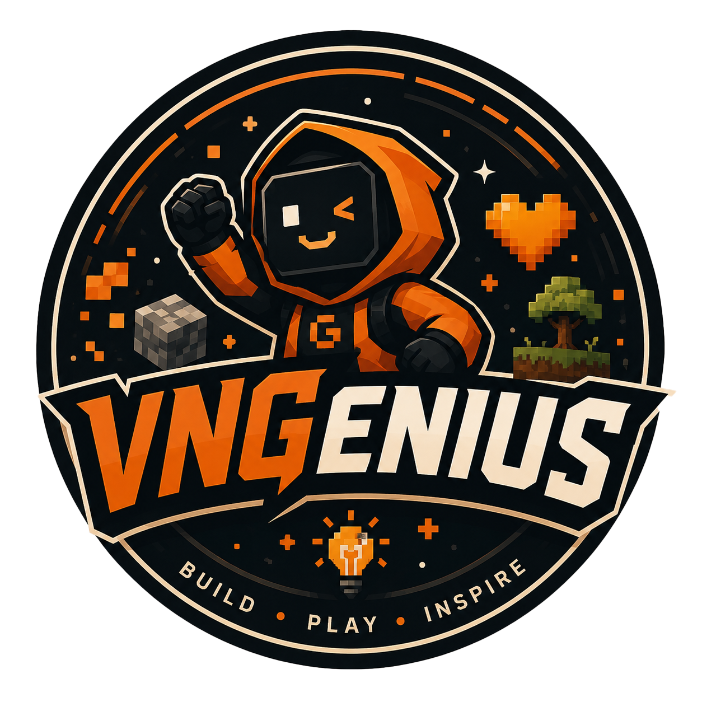

# VNGenius Portfolio

<p align="center">
  
</p>

A long-term portfolio website for **VNGenius**, a multidisciplinary student team building software, games, and AI-powered interactive experiences.

The site presents the team, featured projects, current challenge work, and polished motion details inspired by experimental developer portfolios.

## Highlights

- Interactive grid background with cursor-reactive distortion
- Electric border effects for hero and project visuals
- Theme toggle with diagonal light/dark swipe transition
- Click feedback, subtle sound hooks, and motion-rich UI details
- Team-first content positioning with Prompt-to-Play as one current challenge

## Featured Work

- **ChayNgayDi MazeHunter** - top-down survival maze game prototype
- **APEX-CHAOS** - playable 1v1 browser autobattler co-developed by Tee and QK/Khanh
- **UniQuizz** - AI learning and quiz platform
- **XeNow** - full-stack vehicle rental platform

## Tech Stack

<p>
  
  
  
  
</p>

## Getting Started

Install dependencies:

```bash
npm install
```

Run the development server:

```bash
npm run dev
```

Build for production:

```bash
npm run build
```

Preview the production build:

```bash
npm run preview
```

## Project Structure

```text
public/
  team-logo-vngenius-v3.png
src/
  App.jsx
  components/
    effects.jsx
  styles.css
```

## About

VNGenius focuses on rapid prototyping, product-minded software development, game systems, AI integration, and interactive delivery.

Prompt-to-Play 2026 remains part of the portfolio as the team's current challenge, not the whole identity of the website.
